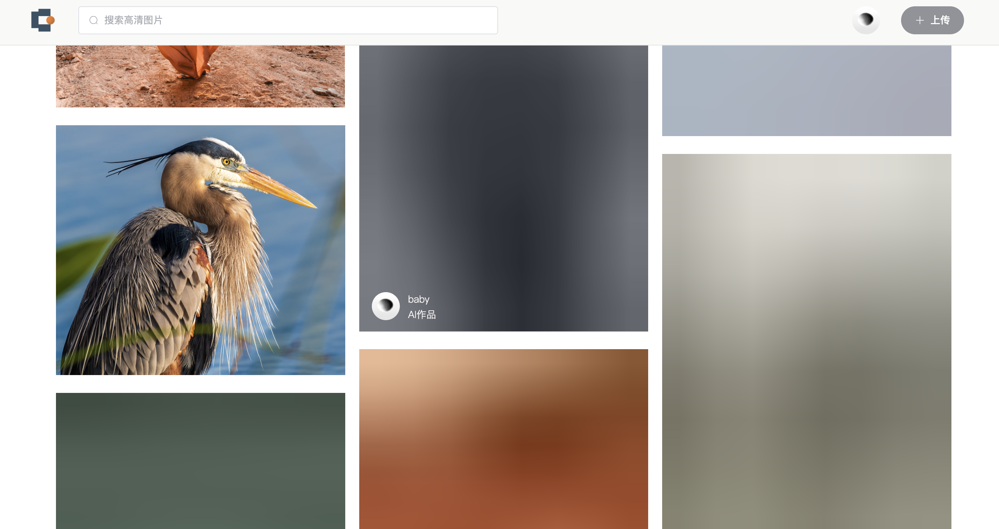
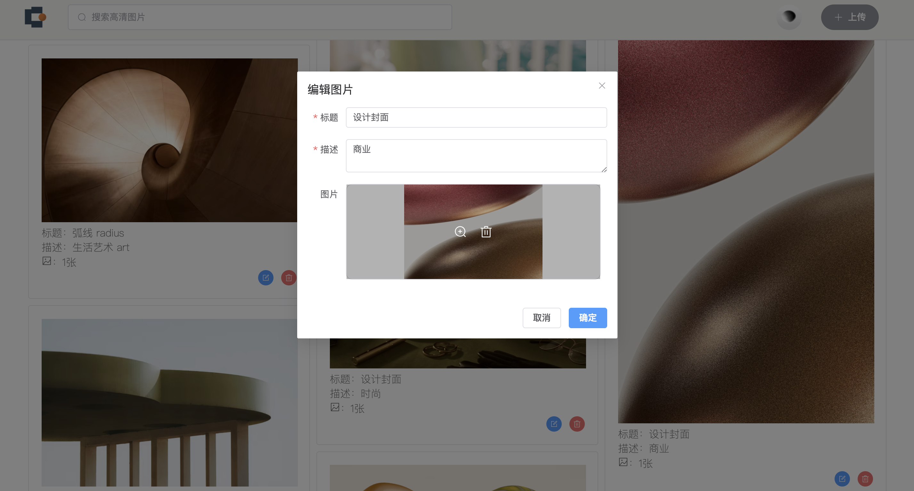
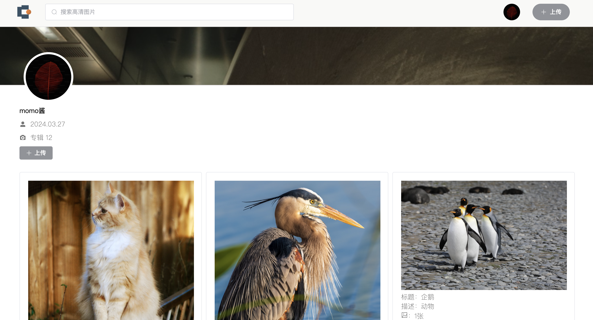
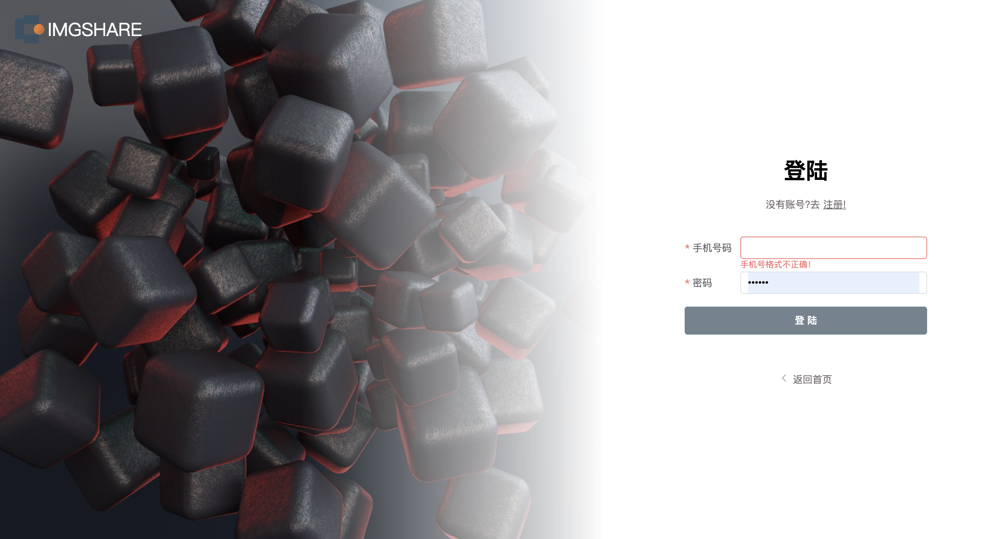

# ImgShare

本项目已部署在[imgshare.tech](https://imgshare.tech)上，欢迎体验，欢迎提Issue和PR。

* 前端：[https://github.com/jiapeiZou/ImgShareVue](https://github.com/jiapeiZou/ImgShareVue)
* 后端：[https://github.com/jiapeiZou/ImgShareServer](https://github.com/jiapeiZou/ImgShareServer)

## ChangeLog

* 2024-04-11：增加分页功能，优化模糊图生成速度
* 2024-04-07：输入框过滤空白
* 2024-04-05：将图片列表组件化，在图片加载完毕前显示模糊图，优化页面展示
* 2024-03-29：删除调试输出，优化提示文本
* 2024-03-27：优化注册/用户搜索等页面展示
* 2024-03-26：统一文字风格
* 2024-03-25：初版

## 编译&安装

```
npm install
npm run build
```

## 运行截图







更多图片见[imgs](imgs)。
